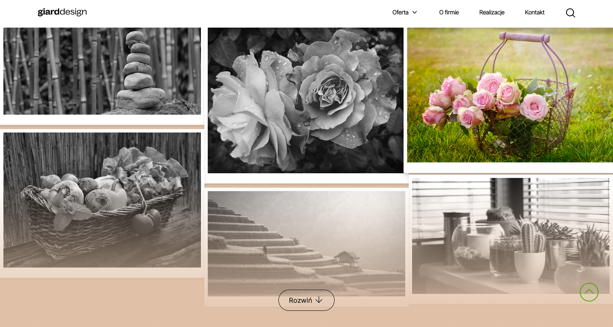

## Task

Create website layout on HTML according to desktop layout. Mobile version interface to create yourself. To stylize use CSS framework to choose: [bootstrap](https://getbootstrap.com/) or [tailwind](https://tailwindcss.com/). Page elements must be functional.

The section of the gallery must be made using the library to choose from: [masonry](https://masonry.desandro.com/), [macyjs](http://macyjs.com/) or other. Photo galleries should run popup. The gallery should  be folded and unfolded.

## Realization

- Site adapted for desktop, tablet and mobile versions. 
- Stylized with CSS framework [tailwind](https://tailwindcss.com/). 
- Build tool [parcel](https://parceljs.org/) for convenient code functionality.  
- The hero section is implemented as a slider using the library [slick](https://www.npmjs.com/package/slick-carousel).  
- Gallery is a [masonry](https://masonry.desandro.com/) realization, can be folded and unfolded. For functionality photos are requested from [pixabay](https://pixabay.com/api/) using [axios](https://www.npmjs.com/package/axios) and render dynamically. Click on the photo - opens a modal window with a description.
- In some modal windows the site search and list of offers for sales, which are forwarded to another page of the site. 
- Mobile menu added for easy use of mobile version. 
- All site elements and links are functional.
- Additional icons for styling are taken from [icons8.com](https://icons8.com/icons/).  
- Added small, user-friendly functionality, chips like a loader or an anchor, scroll buttons up the page.

Visit site: [https://khavrat.github.io/giard-design/](https://khavrat.github.io/giard-design/)

